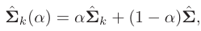

# Data-Science-Interview-Preparation
ISLR = Introduction to Statistical Learning  
ESLR = Elements of Statistical Learning

[clickme](https://github.com/agarnitin86/Data-Science-Interview-Preparation/blob/main/classification.md)

## Generative vs Discriminative Models
## Difference b/w generative & discriminative models
1. [Generative vs. Discriminative Machine Learning Models - Unite.AI](https://www.unite.ai/generative-vs-discriminative-machine-learning-models/)
1. [machine learning - What is the difference between a generative and a discriminative algorithm? - Stack Overflow](https://stackoverflow.com/questions/879432/what-is-the-difference-between-a-generative-and-a-discriminative-algorithm)

|**Generative**|**Discriminative**|
| :-- | :-- |
|Generative models aim to capture the actual distribution of the classes in the dataset.|Discriminative models model the decision boundary for the dataset classes.|
|Generative models predict the joint probability distribution – p(x,y) – utilizing [Bayes Theorem](https://www.unite.ai/what-is-bayes-theorem/).|
Discriminative models learn the conditional probability – p(y|x).

|
|Generative models are computationally expensive compared to discriminative models.|
Discriminative models are computationally cheap compared to generative models.

|
|Generative models are useful for unsupervised machine learning tasks.|Discriminative models are useful for supervised machine learning tasks.|
|
Generative models are impacted by the presence of outliers more than discriminative models.

|
Discriminative models have the advantage of being more robust to outliers, unlike the generative models.

Discriminative models are more robust to outliers compared to generative models.
|
|E.g. Linear Discriminant Analysis, HMM, Bayesian Networks|E.g. SVM, Logistic regression, Decision Trees, Random Forests|

# Parametric & Non-Parametric models
## Difference b/w parametric & non-parametric models
***[Source: ISLR Page-21]*:** 

Parametric methods involve a two-step model-based approach.

1. First, we make an assumption about the functional form, or shape of f. For example, one very simple assumption is that f is linear in X:

This is a linear model, which will be discussed extensively in Chapter 3. Once we have assumed that f is linear, the problem of estimating f is greatly simplified. Instead of having to estimate an entirely arbitrary p-dimensional function f(X), one only needs to estimate the p+1 coefficients  

2. After a model has been selected, we need a procedure that uses the training data to fit or train the model. In the case of the linear model (2.4), we need to estimate the parameters . That is, we want to find values of these parameters such that,

Non-parametric methods do not make explicit assumptions about the functional form of *f*. Instead, they seek an estimate of *f* that gets as close to the data points as possible without being too rough or wiggly. 

Some examples of parametric and non-parametric models:

|**Parametric Models**|**Non-parametric Models**|
| :-: | :-: |
|Linear regression|KNN|
|Logistic regression|Decision Trees, Random Forests|
## Advantages/disadvantages of Parametric/Non-Parametric models
***[Source: ISLR Page-23]*:** 

Non-parametric approaches can have a major advantage over parametric approaches: by avoiding the assumption of a particular functional form for *f*, they have the potential to accurately fit a wider range of possible shapes for f. Any parametric approach brings with it the possibility that the functional form used to estimate f is very different from the true f, in which case the resulting model will not fit the data well. 

In contrast, non-parametric approaches completely avoid this danger, since essentially no assumption about the form of f is made. But non-parametric approaches do suffer from a major disadvantage: since they do not reduce the problem of estimating f to a small number of parameters, a very large number of observations (far more than is typically needed for a parametric approach) is required in order to obtain an accurate estimate for f.
# Bias & Variance
## What do we mean by the variance and bias of a statistical learning method? 
**Variance** refers to the amount by which *f* would change if we estimated it using a different training data set. Since the training data are used to fit the statistical learning method, different training data sets will result in a different *f* . But ideally the estimate for *f* should not vary too much between training sets. However, if a method has high variance, then small changes in the training data can result in large changes in *f*. In general, more flexible statistical methods have higher variance.

On the other hand, 

**Bias** refers to the error that is introduced by approximating a real-life problem, which may be extremely complicated, by a much simpler model. For example, linear regression assumes that there is a linear relationship between *Y* and . It is unlikely that any real-life problem truly has such a simple linear relationship, and so performing linear regression will undoubtedly result in some bias in the estimate of *f*.

## How to handle data imbalance:
1. Under sampling/Oversampling
1. SMOTE
1. Better evaluation metric – like Lift, ROC curves, PR Curves
1. Cost sensitive learning : [Cost-Sensitive Learning for Imbalanced Classification (machinelearningmastery.com)](https://machinelearningmastery.com/cost-sensitive-learning-for-imbalanced-classification/)
1. Class weight balancing : [How To Dealing With Imbalanced Classes in Machine Learning (analyticsvidhya.com)](https://www.analyticsvidhya.com/blog/2020/10/improve-class-imbalance-class-weights/)
1. Weighted loss function: [Handling Class Imbalance by Introducing Sample Weighting in the Loss Function | by Ishan Shrivastava | GumGum Tech Blog | Medium](https://medium.com/gumgum-tech/handling-class-imbalance-by-introducing-sample-weighting-in-the-loss-function-3bdebd8203b4)
1. One Class SVM
#
# Regression
## Difference b/w TSS (Total Sum of Squares) & RSS (Residual Sum of Square)

**TSS** measures the total variance in the response **Y** and can be thought of as the amount of variability inherent in the response before the regression is performed. In contrast, **RSS** measures the amount of variability that is left unexplained after performing the regression. Hence, TSS-RSS measures the amount of variability in the response that is explained (or removed) by performing the regression 
## Difference b/w R2 and Adjusted R2
***[Source: ISLR Page-212]*:**

|**R2**|**Adjusted R2**|
| :-- | :-- |
||, where n = number of data points, d = model with d variables|
| will increase as more variables are added to the model.|
Maximizing the  is equivalent to minimizing . While RSS always decreases as the number of variables in the model increases, RSS/(n-d-1) may increase or decrease, due to the presence of d in the denominator.

The intuition behind the  is that, once all of the correct variables have been included in the model, adding additional noise variables will lead to only a very small decrease in RSS. Since adding noise variables leads to an increase in d, such variables will lead to an increase in RSS/(n-d-1), and consequently a decrease in the . Therefore, in theory, the model with the largest  will have only correct variables and no noise variables.
|

## LR-Assumptions & Verification
1. [7 Classical Assumptions of Ordinary Least Squares (OLS) Linear Regression - Statistics By Jim](https://statisticsbyjim.com/regression/ols-linear-regression-assumptions/)
1. [Verifying the Assumptions of Linear Regression in Python and R | by Eryk Lewinson | Towards Data Science](https://towardsdatascience.com/verifying-the-assumptions-of-linear-regression-in-python-and-r-f4cd2907d4c0#:~:text=Verifying%20the%20Assumptions%20of%20Linear%20Regression%20in%20Python,the%20context%20of%20linear%20regression.%20More%20items...%20)

Following are the assumptions:
1. Random error  has 
1.  is independent of X
1. **[Source: ISLR Page-86]**: Two of the most important assumptions state that the relationship between the predictors and response are additive and linear. The additive assumption means that the effect of changes in a predictor  on the response Y is independent of the values of the other predictors. The linear assumption states that the change in the response Y due to a one-unit change in  is constant, regardless of the value of 
1. **[Source: ISLR Page-93]**: An important assumption of the linear regression model is that the error terms, ε1,ε2, …,εn, are uncorrelated.
1. **[Source: ISLR Page-95]**: Error terms have a constant variance, . Unfortunately, it is often the case that the variances of the error terms are non-constant. For instance, the variances of the error terms may increase with the value of the response. One can identify non-constant variances in the errors, or heteroscedasticity, from the presence of a funnel shape in the residual plot.
## Implication of the assumption that errors are independent & identically distributed
Because of this assumption, we average squared errors uniformly in our Expected Prediction error criterion. If the errors were dependent, then, weightage of each error might have been different in the error function.
## Difference b/w Collineraity & Multi Collinearity 
1. [terminology - What is collinearity and how does it differ from multicollinearity? - Cross Validated (stackexchange.com)](https://stats.stackexchange.com/questions/254871/what-is-collinearity-and-how-does-it-differ-from-multicollinearity) 
1. [Correlation vs Collinearity vs Multicollinearity – Quantifying Health](https://quantifyinghealth.com/correlation-collinearity-multicollinearity/)

**Collinearity** is a linear association between two explanatory variables. Multicollinearity in a multiple regression model are highly linearly related associations between two or more explanatory variables. 

In case of perfect **multicollinearity**, the design matrix X has less than full rank, and therefore the moment matrix  cannot be matrix inverted. Under these circumstances, for a general linear model , the ordinary least-squares estimator  does not exist.
## How to assess Multicollinearity?
***[Source: ISLR Page-101]*** Instead of inspecting the correlation matrix, a better way to assess multicollinearity is to compute the variance inflation factor (VIF). The VIF is variance inflation factor, the ratio of the variance of βj when fitting the full model divided by the variance of βj if fit on its own. The smallest possible value for VIF is 1, which indicates the complete absence of collinearity
## How to assess the quality of Linear Regression model?
***[Source: ISLR Page-68]***. The quality of a linear regression fit is typically assessed using two related quantities: the residual standard error (RSE) and the  statistic.

where,

The RSE provides an absolute measure of lack of fit of the model (3.5) to the data. But since it is measured in the units of Y, it is not always clear what constitutes a good RSE. The  statistic provides an alternative measure of fit. It takes the form of a proportion—the proportion of variance explained—and so it always takes on a value between 0 and 1, and is independent of the scale of Y.

To calculate , we use the formula, 

Where, 

 is the total sum of squares, and RSS is defined in (3.16). TSS measures the total variance in the response Y, and can be thought of as the amount of variability inherent in the response before the regression is performed. In contrast, RSS measures the amount of variability that is left unexplained after performing the regression. Hence, TSS − RSS measures the amount of variability in the response that is explained (or removed) by performing the regression, and  measures the proportion of variability in Y that can be explained using X. 
## Regression approaches in order of linearity
***[Source: ISLR Page-266]***

|**Regression Approach**|**Explanation**|
| :-: | :-- |
|Linear Regression||
|Polynomial Regression|Polynomial regression extends the linear model by adding extra predictors, obtained by raising each of the original predictors to a power.|
|Step Functions|Step functions cut the range of a variable into K distinct regions in order to produce a qualitative variable. This has the effect of fitting a piecewise constant function.|
|Regression Splines|Regression splines are more flexible than polynomials and step functions, and in fact are an extension of the two. They involve dividing the range of X into K distinct regions. Within each region, a polynomial function is fit to the data.|
|Smoothing Splines|Smoothing splines are similar to regression splines, but arise in a slightly different situation. Smoothing splines result from minimizing a residual sum of squares criterion subject to a smoothness penalty.|
|Local Regression|Local regression is similar to splines, but differs in an important way. The regions are allowed to overlap, and indeed they do so in a very smooth way.|
|Generalized Additive Models|Generalized additive models allow us to extend the methods above to deal with multiple predictors.|

## Approaches for Subset selection
***[Source: ESLR Page-57]***

1. Best subset selection
1. Forward stepwise selection
1. Backward stepwise selection
1. Hybrid (Forward + Backward stepwise) selection
1. Forward stagewise regression

|Best subset|
1. For each k ∈ {0, 1, 2, . . . , p}, where p is #predictors, the subset of size k that gives smallest residual sum of squares.

2. Typically, we choose the smallest model that minimizes an estimate of the expected prediction error.
|
| :- | :-- |
|Forward stepwise|
1. Is a greedy algorithm 

2. Starts with the intercept, and,

3. then sequentially adds into the model the predictor that most improves the fit. With many candidate predictors, this might seem like a lot of computation; however, clever updating algorithms can exploit the QR decomposition for the current fit to rapidly establish the next candidate 

4. for large p, we cannot compute the best subset sequence, but we can always compute the forward stepwise sequence(even when p ≫ N ).

5. forward stepwise is a more constrained search, and will have lower variance, but perhaps more bias than best subset
|
|Backward stepwise|
1. starts with the full model, then,

2. Sequentially deletes the predictor that has the least impact on the fit. 

3. The candidate for dropping is the variable with the smallest Z-score. Backward selection can only be used when N > p, while forward stepwise can always be used.
|
|Hybrid selection|
consider both forward and backward moves at each step, and select

the “best” of the two.
|
|Forward stagewise|
1. more constrained than forward stepwise regression.

2. Starts like forward-stepwise regression, with an intercept equal to ȳ, and centered predictors with coefficients initially all 0.

3. At each step, the algorithm identifies the variable most correlated with the current residual. 

4. It then computes the simple linear regression coefficient of the residual on this chosen variable, and then adds it to the current coefficient for that variable. This is continued till none of the variables have correlation with the residuals—i.e. the least-squares fit when N > p.
|

## Difference between Ridge & Lasso regression.

Ridge regression:

Lasso Regression:

|Ridge Regression|Lasso Regression|
| :-- | :-- |
|The shrinkage penalty is applied to  , but not to the intercept . We do not want to shrink the intercept, which is simply a measure of the mean value of the response when . (More explanation in ESLR pg. 64)||
|
It is best to apply ridge regression after

standardizing the predictors, using the formula

Because, the ridge solutions are not equivariant under scaling of the inputs.
||
|Ridge regression will include all p predictors in the final model. The penalty  in (6.5) will shrink all of the coefficients towards zero, but it will not set any of them exactly to zero (unless ). This may not be a problem for prediction accuracy, but it can create a challenge in model interpretation in settings in which the number of variables p is quite large. |L1 penalty has the effect of forcing some of the coefficient estimates to be exactly equal to zero when the tuning parameter λ is sufficiently large.|
|Uses l2 penalty|Uses l1 penalty|
|The l2 norm of a coefficient vector β is given by |The l1 norm of a coefficient vector β is given by .|
|||
|Will include all p predictors in the final model|Performs variable selection by setting coefficients of some to the variables to 0|
|Does not yield sparse models|lasso yields sparse models|
|It produces less interpretable models that involve all the predictors.|it produces simpler and more interpretable models that involve only a subset of the predictors.|
|In the case of orthonormal inputs, the ridge estimates are just a scaled version of the least squares estimates, that is, β̂ ridge = β̂/(1 + λ).||
|||

## Why is it that the lasso, unlike ridge regression, results in coefficient estimates that are exactly equal to zero?
Refer to page 221 of Introduction to Statistical Learning. Section- “*The Variable Selection Property of the Lasso*”

## Bayesian Interpretation for Ridge Regression and the Lasso
## What is confidence interval and prediction interval in Linear Regression?
## Derive equations for Least squares in vector & matrix notation
## Can we use Linear Regression for binary classification?
#
# Classification
## Some approaches for classification
1. Using linear regression of a Indicator Matrix
1. Linear Discriminant Analysis
1. Quadratic Discriminant Analysis
1. Regularized Discriminant Analysis ***[Source: ESLR Page-112]***  
1. Logistic Regression

## What is log odds?
1. [Log Oddds Definition](https://www.statisticshowto.com/log-odds/#:~:text=Taking%20the%20logarithm%20of%20the,p%2F(1%2Dp)%5D)
2. [What and Why of Log Odds](https://towardsdatascience.com/https-towardsdatascience-com-what-and-why-of-log-odds-64ba988bf704)

The odds ratio is the probability of success/probability of failure. As an equation, that’s P(A)/P(-A), where P(A) is the probability of A, and P(-A) the probability of ‘not A’ (i.e. the complement of A).

Taking the logarithm of the odds ratio gives us the log odds of A, which can be written as

log(A) = log(P(A)/P(-A)),
Since the probability of an event happening, P(-A) is equal to the probability of an event not happening, 1 – P(A), we can write the log odds as

Where:
p = the probability of an event happening
1 – p = the probability of an event not happening

## MLE Estimation for Logistic Regression
Although we could use (non-linear) least squares to fit the logistic model , the more general method of maximum likelihood is preferred, since it has better statistical properties. In logistic regression, we use the logistic function,

Dividing (1) by (2) & taking log on both sides,

Let us make following parametric assumption:

MLE is used to find the model parameters while maximizing, 

***P(observed data|model parameters)***

For Logistic Regression, we need to find the model parameter **w** that maximizes conditional probability,

## Resources to understand MLE estimation for Logistic Regression
1. [lecture05.pdf (zstevenwu.com)](https://zstevenwu.com/courses/s20/csci5525/resources/slides/lecture05.pdf)
1. [Logit.dvi (rutgers.edu)](https://stat.rutgers.edu/home/pingli/papers/Logit.pdf)
1. [ADAfaEPoV (cmu.edu)](https://www.stat.cmu.edu/~cshalizi/uADA/12/lectures/ch12.pdf)
1. [A Gentle Introduction to Logistic Regression With Maximum Likelihood Estimation (machinelearningmastery.com)](https://machinelearningmastery.com/logistic-regression-with-maximum-likelihood-estimation/)
1. [Logistic Regression and Maximum Likelihood Estimation Function | by Puja P. Pathak | CodeX | Medium](https://medium.com/codex/logistic-regression-and-maximum-likelihood-estimation-function-5d8d998245f9)

## Difference b/w Logistic Regression & Linear Discriminant Analysis
***[Source: ISLR Page-151]***

|**Logistic Regression**|**Linear DA**|
| :-- | :-- |
|Parameters  are estimated using Maximum Likelihood estimation|Parameters are estimated using estimated mean & variance from normal distribution|
|Decision boundary- Linear|Decision boundary- Linear|
|logistic regression can outperform LDA if the Gaussian assumptions are not met|LDA assumes that the observations are drawn from a Gaussian distribution with a common covariance matrix in each class, and so can provide some improvements over logistic regression when this assumption approximately holds.|

## Difference b/w Linear & Quadratic Discriminant Analysis
***[Source: ESLR Page-109]*** and [lecture9-stanford](https://web.stanford.edu/class/stats202/content/lec9.pdf)

|**Linear DA**|**Quadratic DA**|
| :-- | :-- |
|All the classes have common covariance matrix Σk = Σ ∀ *k*|Each class has its own covariance matrix, Σk|
|Decision boundary- Linear|Decision boundary- Quadratic|
|Discriminant Function|
Discriminant Function

|
|Since covariance matrices is common for all classes no such problem|Since separate covariance matrices must be computed for each class, when p (#Features) is large, number of parameters increases dramatically.|
|***[Source: ISLR Page-142]*** LDA classifier results from assuming that the observations within each class come from a normal distribution with a class-specific mean vector and a common variance σ2|***[Source: ISLR Page-142]*** QDA classifier results from assuming that the observations within each class come from a normal distribution with a class-specific mean vector and covariance matrix Σk|
|With p predictors, estimating a covariance matrix requires estimating p(p+1)/2 parameters. |With p predictors and K classses, estimating a covariance matrix requires estimating K.p(p+1)/2 parameters|
|LDA is a much less flexible classifier|QDA is a more flexible classifier|
|Can have low variance high bias|Can have high variance low bias|

## What happens when the classes are well separated in Logistic Regression?
When the classes are well-separated, the parameter estimates for the logistic regression model are surprisingly unstable. Linear discriminant analysis does not suffer from this problem.
***[Source: ESLR, Page-128]*** If the data in a two-class logistic regression model can be perfectly separated by a hyperplane, the maximum likelihood estimates of the parameters are undefined (i.e., infinite; see Exercise 4.5). The LDA coefficients for the same data will be well defined, since the marginal likelihood will not permit these degeneracies.
<https://stats.stackexchange.com/questions/224863/understanding-complete-separation-for-logistic-regression>
<https://stats.stackexchange.com/questions/239928/is-there-any-intuitive-explanation-of-why-logistic-regression-will-not-work-for>

## Compare SVM & Logistic Regression
***[Source: ISLR Page-357]*** SVM loss function is exactly zero for observations for which =1&space;">  these correspond to observations that are on the correct side of the margin. In contrast, the loss function for logistic regression is not exactly zero anywhere. But it is very small for observations that are far from the decision boundary. Due to the similarities between their loss functions,  logistic regression and the support vector classifier often give very similar results. When the classes are well separated, SVMs tend to behave better than logistic regression; in more overlapping regimes, logistic regression is often preferred.

#
# KNN
## Effect of K on training error
***[Source: ESLR Page 15]*** Error on the training data should be approximately an increasing function of k, and will always be 0 for k = 1. 
It appears that k-nearest-neighbor fits have a single parameter, the number of neighbors k, compared to the p parameters in least-squares fits. Although this is the case, we will see that the effective number of parameters of k-nearest neighbors is N/k and is generally bigger than p, and decreases with increasing k. To get an idea of why, note that if the neighborhoods were nonoverlapping, there would be N/k neighborhoods and we would fit one parameter (a mean) in each neighborhood. It is also clear that we cannot use sum-of-squared errors on the training

set as a criterion for picking k, since we would always pick k = 1.
## How does bias & variance vary for KNN with the choice of K?
***[Source: ESLR Page 40]*** The choice of K has a drastic effect on the KNN classifier obtained. When K = 1, the decision boundary is overly flexible and finds patterns in the data that don’t correspond to the Bayes decision boundary. This corresponds to a classifier that has low bias but very high variance. As K grows, the method becomes less flexible and produces a decision boundary that is close to linear. This corresponds to a low-variance but high-bias classifier. 
Just as in the regression setting, there is not a strong relationship between the training error rate and the test error rate. With K = 1, the KNN training error rate is 0, but the test error rate may be quite high. In general, as we use more flexible classification methods, the training error rate will decline but the test error rate may not. 
# SVM

## What is Hyperplane?
***[Source: ISLR Page-68]***: In a p-dimensional space, a hyperplane is a flat affine subspace of hyperplane dimension p −1 For instance, in two dimensions, a hyperplane is a flat one-dimensional subspace—in other words, a line. In three dimensions, a hyperplane is a flat two-dimensional subspace—that is, a plane. In p > 3 dimensions, it can be hard to visualize a hyperplane, but the notion of a
(p − 1)-dimensional flat subspace still applies. The mathematical definition of a hyperplane is quite simple. In two dimensions, a hyperplane is defined by the equation

In p-dimensional setting,

If a point  in p-dimensional space (i.e. a vector of length p) satisfies above eq., then X lies on the hyperplane.
Now, suppose that X does not satisfy the eq; rather,

, then, X lies to one side of the hyperplane

On the other hand, If, 

 then, X lies to the other side of the hyperplane.

Some Resource on equation of line  <https://math.stackexchange.com/questions/2533114/equation-of-a-hyperplane-in-two-dimensions>

## Variations of SVM
1. Maximal Margin Classifier
1. Support Vector Classifier
1. Support Vector Machines

## Comparison b/w Maximal Margin Classifier, Support Vector Classifier, Support Vector Machine

|MM Classifier|SVC|SVM|
| :- | :- | :- |
|Used when separating hyperplane exist.|generalization of the maximal margin classifier to the non-separable case|Generalization of SVC to non-separable & non-linear cases using Kernels|
|When separating hyperplane does not exist, the optimization problem has no solution with M > 0|Uses soft margin to identify hyperplane that almost separates the classes|Uses soft margin to identify hyperplane that almost separates the classes|
|An observation can only be on the right side of the margin, and the hyperplane|An observation can be not only on the wrong side of the margin, but also on the wrong side of the hyperplane.|An observation can be not only on the wrong side of the margin, but also on the wrong side of the hyperplane.|
||Only observations that either lie on the margin or that violate the margin will affect the hyperplane, and hence the classifier obtained.|–Same as SVC–|
||Changing the position of an observation that lies strictly on the correct side of the margin would not change the classifier at all, provided that its position remains on the correct side of the margin|–Same as SVC–|
||Observations that lie directly on the margin, or on the wrong side of the margin for their class, are known as support vectors|–Same as SVC–|
||When the tuning parameter C is large, then the margin is wide, many observations violate the margin, and so there are many support vectors. In this case, many observations are involved in determining the hyperplane. This classifier has low variance and potentially high bias. When C is small ->> fewer support vector ->> High variance, low bias||

## How does SVM select support vectors?
## Tree Based Models

## Gini Index

Here  represents the proportion of training observations in the mth region that are from the kth class. a measure of total variance across the K classes. It is not hard to see that the Gini index takes on a small value if all of the  ’s are close to zero or one. For this reason the Gini index is referred to as a measure of node purity—a small value indicates that a node contains predominantly observations from a single class. 

## Cross-Entropy

Since 0 ≤  ≤ 1, it follows that 0 ≤ − log . One can show that the cross- entropy will take on a value near zero if the ’s are all near zero or near one. Therefore, like the Gini index, the cross-entropy will take on a small value if the mth node is pure. In fact, it turns out that the Gini index and the cross-entropy are quite similar numerically.  

## Why Bagging reduces over-fitting or variance?

***[Source: ISLR Page-316]*** Given a set of n independent observations Z1 , . . . , Zn, each with variance σ2, the variance of the mean  of the observations is given by σ2/n. In other words, averaging a set of observations reduces variance.

Explanation of why the above happens: [https://en.wikipedia.org/wiki/Variance#Properties](https://en.wikipedia.org/wiki/Variance#Properties)

Hence a natural way to reduce the variance and hence increase the prediction accuracy of a statistical learning method is to take many training sets from the population, build a separate prediction model using each training set, and average the resulting predictions. In other words, we could calculate  using **B** separate training sets, and average them in order to obtain a single low-variance statistical learning model, given by,

Of course, this is not practical because we generally do not have access to multiple training sets. Instead, we can bootstrap, by taking repeated samples from the (single) training data set. In this approach we generate B different bootstrapped training data sets. We then train our method on the bth bootstrapped training set in order to get , and finally average all the predictions, to obtain

## OOB Error Estimation

***[Source: ISLR Page-317]*** The key to bagging is that trees are repeatedly fit to bootstrapped subsets of the observations. One can show that on average, each bagged tree makes use of around two-thirds of the observations. The remaining one-third of the observations not used to fit a given bagged tree are referred to as the out-of-bag (OOB) observations. We can predict the response for the ith observation using each of the trees in which that observation was OOB. This will yield around B/3 predictions for the ith observation. In order to obtain a single prediction for the ith observation, we can average these predicted responses (if regression is the goal) or can take a  majority vote (if classification is the goal). This leads to a single OOB prediction for the ith observation. An OOB prediction can be obtained in this way for each of the n observations, from which the overall OOB MSE (for a regression problem) or classification error (for a classification  problem) can be computed. The resulting OOB error is a valid estimate of the test error for the  bagged model, since the response for each observation is predicted using only the trees that were not fit using that observation.

## How Random Forests ensure that trees are decorrelated?

***[Source: ISLR Page-320]*** Random forests provide an improvement over bagged trees by way of a random small tweak  that decorrelates the trees. As in bagging, we build a number  forest of decision trees on bootstrapped training samples. But when building these decision trees, each time a split in a tree is considered, a random sample of m predictors is chosen as split candidates from the full set of p predictors. The split is allowed to use only one of those m predictors. A fresh sample of √m predictors is taken at each split, and typically we choose m ≈ p—that is, the number of predictors considered at each split is approximately equal to the square root of the total number of predictors (4 out of the 13 for the Heart data). In other words, in building a random forest, at each split in the tree, the algorithm is not even allowed to consider a majority of the available predictors. This may sound crazy, but it has a clever rationale. Suppose that there is one very strong predictor in the data set, along with a number of other moderately strong predictors. Then in the collection of bagged trees, most or all of the trees will use this strong predictor in the top split. Consequently, all of the bagged trees will look quite similar to each other. Hence the predictions from the bagged trees will be highly correlated. Unfortunately, averaging many highly correlated quantities does not lead to as large of a reduction in variance as averaging many uncorrelated quantities. In particular, this means that bagging will not lead to a substantial reduction in variance over a single tree in this setting. Random forests overcome this problem by forcing each split to consider only a subset of the predictors. Therefore, on average (p − m)/p of the splits will not even consider the strong predictor, and so other predictors will have more of a chance. We can think of this process as decorrelating the trees, thereby making the average of the resulting trees less variable and hence more reliable. The main difference between bagging and random forests is the choice of predictor subset size m. For instance, if a random forest is built using m = p, then this amounts simply to bagging.

## Does Random Forest overfit if we increase the number of trees?

***[Source: ISLR Page-321]*** As with bagging, random forests will not overfit if we increase B, so in practice we use a value of B sufficiently large for the error rate to have settled down.

## Boosting
[Boosting Machine Learning Tutorial | Adaptive Boosting, Gradient Boosting, XGBoost | Edureka - YouTube](https://www.youtube.com/watch?v=kho6oANGu_A)

## Does Boosting overfit if we increase the number of trees?

***[Source: ISLR Page-323]*** Unlike bagging and random forests, boosting can overfit if B is too large, although this overfitting tends to occur slowly if at all. We use cross-validation to select B. (B is the number of trees)

## Compare DT, Bagging, RF, Boosting

|Model|Description|
| :-- | :-- |
|Bagging|We build a number of decision trees on bootstrapped training samples using all the predictors|
|RF|
We build a number of decision trees on bootstrapped training samples. But when building these decision trees, each time a split in a tree is considered, a random sample of m predictors is chosen as split candidates from the full set of p predictors. The split is allowed to use only one of those m predictors. A fresh sample of m predictors is taken at each split, and typically we choose m ≈ √p. 

Why does RF reduce more variance as compared to Bagging? Suppose that there is one very strong predictor in the data set, along with a number of other moderately strong predictors. Then in the collection of bagged trees, most or all of the trees will use this strong predictor in the top split. Consequently, all of the bagged trees will look quite similar to each other. Hence the predictions from the bagged trees will be highly correlated. Unfortunately, averaging many highly correlated quantities does not lead to as large of a reduction in  variance as averaging many uncorrelated quantities. In particular, this means that bagging will not lead to a substantial reduction in variance  over a single tree in this setting. Random forests overcome this  problem by forcing each split to consider only a subset of the predictors. Therefore, on average (p − m)/p of the splits will not even consider the strong predictor, and so other predictors will have more of a chance. We can think of this process as decorrelating the trees, thereby making the average of the resulting trees less variable and hence more reliable.
|
|Boosting|Boosting works similar to Bagging, except that the trees are grown sequentially: each tree is grown using information from previously grown trees. Boosting does not involve bootstrap sampling; instead each tree is fit on a modified version of the original data set.|
## Cross Validation

## Compare LOOCV(Leave One Out Cross Validation) with K-Fold CV

***[Source: ISLR Page-180]*** 

|LOOCV|K-Fold CV|
| :-- | :-- |
|LOOCV has the potential to be expensive to implement, since the model has to be fit n times. This can be very time consuming if n is large, and if each individual model is slow to fit.|Computationally less expensive|
|each training set contains n − 1 observations - has lower bias|each training set contains (k − 1)n/k observations—fewer than in the LOOCV approach - has higher bias|
|LOOCV has higher variance than does k-fold CV with k<n. When we perform LOOCV, we are in effect averaging the outputs of n fitted models, each of which is trained on an almost identical set of observations; therefore, these outputs are highly (positively) correlated with each other|
When we perform k-fold CV with k<n, we are averaging the outputs of k fitted models that are somewhat less correlated with each other, since the overlap between the training sets in each model is smaller.

Since the mean of many highly correlated quantities has higher variance than does the mean of many quantities that are not as highly correlated, the test error estimate resulting from LOOCV tends to have higher variance than does the test error estimate resulting from k-fold CV.
|
## Classification Evaluation Metrics
1. Sensitivity = Recall = True Positive Rate
 

   
2. Specificity = True Negative Rate

   
3. Precision

4. False Positive Rate

## Lift
1. [Lift (data mining) - Wikipedia](https://en.wikipedia.org/wiki/Lift_\(data_mining\))
1. [The Lift Curve in Machine Learning explained | Learn Machine Learning (howtolearnmachinelearning.com)](https://howtolearnmachinelearning.com/articles/the-lift-curve-in-machine-learning/)
## PCA

## Does scaling affect PCA outcome?

***[Source: ISLR Page-381]*** If in a dataset variables are measured on different scales, then the variable with large values might have high variance. If we perform PCA on the unscaled variables, then the first principal component loading vector will have a very large loading for this high variance variable, since that variable has by far the highest variance. 

It is undesirable for the principal components obtained to depend on an arbitrary choice of scaling, and hence, we typically scale each variable to have standard deviation one before we perform PCA. 

## What are loading vectors and score vectors?
## Deep Learning

## How does dropout work in deep learning algorithms?
1. [Dropout Regularization - Practical Aspects of Deep Learning | Coursera](https://www.coursera.org/lecture/deep-neural-network/dropout-regularization-eM33A)
1. [Why Dropout is so effective in Deep Neural Network? | Towards Data Science](https://towardsdatascience.com/introduction-to-dropout-to-regularize-deep-neural-network-8e9d6b1d4386)

## What is the vanishing & exploding gradient problem? How to identify it? How is it solved?
1. [The Vanishing/Exploding Gradient Problem in Deep Neural Networks | by Kurtis Pykes | Towards Data Science](https://towardsdatascience.com/the-vanishing-exploding-gradient-problem-in-deep-neural-networks-191358470c11)
1. [The Vanishing Gradient Problem. The Problem, Its Causes, Its… | by Chi-Feng Wang | Towards Data Science](https://towardsdatascience.com/the-vanishing-gradient-problem-69bf08b15484)

In a network of n hidden layers, n derivatives will be multiplied together. If the derivatives are large then the gradient will increase exponentially as we propagate down the model until they eventually explode, and this is what we call the problem of exploding gradient. Alternatively, if the derivatives are small then the gradient will decrease exponentially as we propagate through the model until it eventually vanishes, and this is the vanishing gradient problem.

**Identifying Exploding gradient:**

- The model is not learning much on the training data therefore resulting in a poor loss.
- The model will have large changes in loss on each update due to the models instability.
- The models loss will be NaN during training.
- Model weights grow exponentially and become very large when training the model.
- The model weights become NaN in the training phase.

**Identifying Vanishing gradient:**

- The model will improve very slowly during the training phase and it is also possible that training stops very early, meaning that any further training does not improve the model.
- The weights closer to the output layer of the model would witness more of a change whereas the layers that occur closer to the input layer would not change much (if at all).
- Model weights shrink exponentially and become very small when training the model.
- The model weights become 0 in the training phase.

**Solving gradient problem:**
1. Reducing the amount of Layers
1. Choosing a small learning rate so that there are no large updates in the gradients
1. Gradient Clipping (Exploding Gradients)
1. Weight Initialization
1. use other activation functions, such as ReLU, which doesn’t cause a small derivative.
1. Residual networks
1. Add batch normalization layers
1. Use LSTM Networks

## What is Gradient Clipping?
1. [Introduction to Gradient Clipping Techniques with Tensorflow | cnvrg.io](https://cnvrg.io/gradient-clipping/#:~:text=%20Gradient%20clipping%20can%20be%20applied%20in%20two,by%20value%202%20Clipping%20by%20norm%20More%20)
1. [Understanding Gradient Clipping (and How It Can Fix Exploding Gradients Problem) - neptune.ai](https://neptune.ai/blog/understanding-gradient-clipping-and-how-it-can-fix-exploding-gradients-problem)

Gradient clipping involves forcing the gradients to a certain number when they go above or below a defined threshold. 

**Types of Clipping techniques**
Gradient clipping can be applied in two common ways:

**Clipping by value** : If a gradient exceeds some threshold value, we clip that gradient to the threshold. If the gradient is less than the lower limit then we clip that too, to the lower limit of the threshold. The algorithm is as follows:

    g ← ∂C/∂W
    if ‖g‖ ≥ max_threshold or ‖g‖ ≤ min_threshold then
        g ← threshold (accordingly)
    end if
where max\_threshold and min\_threshold are the boundary values and between them lies a range of values that gradients can take. g, here is the gradient, and  ‖g ‖ is the norm of g. 

**Clipping by norm**: We clip the gradients by multiplying the unit vector of the gradients with the threshold. 
The algorithm is as follows:

    g ← ∂C/∂W
    if ‖g‖ ≥ threshold then
        g ← threshold * g/‖g‖
    end if
where the threshold is a hyperparameter, g is the gradient, and  ‖g ‖ is the norm of g. Since g/‖ g‖ is a unit vector, after rescaling the new g will have norm equal to threshold. Note that if  ‖g‖ < c, then we don’t need to do anything,

Gradient clipping ensures the gradient vector g has norm at most equal to threshold. 

## Compare Activation Functions
1. [Activation Functions: Sigmoid, Tanh, ReLU, Leaky ReLU, Softmax | by Mukesh Chaudhary | Medium](https://medium.com/@cmukesh8688/activation-functions-sigmoid-tanh-relu-leaky-relu-softmax-50d3778dcea5)

## Compare Loss Functions
1. [Loss Function | Loss Function In Machine Learning (analyticsvidhya.com)](https://www.analyticsvidhya.com/blog/2019/08/detailed-guide-7-loss-functions-machine-learning-python-code/)

## Compare Optimizers
[Line to coursera](https://www.coursera.org/learn/deep-neural-network/lecture/qcogH/mini-batch-gradient-descent)

1. Gradient Descent
1. Stochastic Gradient Descent - Same as Gradient descent, but for each sample
1. Mini Batch Gradient Descent - Same as Gradient descent, but for each mini batch
1. Gradient Descent with Momentum - Each update is not made with the current value of gradient, but with the exponential moving average of the gradients:                                   

5. Root Mean Square Propagation (RMSProp):

6. Adaptive Moment Estimate (Adam)

## How to reduce overfitting

1. Adding more data 
2. Data Augmentation 
3. Dropout
4. Early Stopping

## CNN
[(302) C4W1L01 Computer Vision - YouTube](https://www.youtube.com/watch?v=ArPaAX_PhIs&list=PLkDaE6sCZn6Gl29AoE31iwdVwSG-KnDzF&index=1)

## Word2Vec
[Word2Vec For Word Embeddings -A Beginner's Guide - Analytics Vidhya](https://www.analyticsvidhya.com/blog/2021/07/word2vec-for-word-embeddings-a-beginners-guide/)

## GloVec
[glove.pdf (stanford.edu)](https://nlp.stanford.edu/pubs/glove.pdf)

## Positional Embeddings

<https://www.youtube.com/watch?v=eEGDEJfP74k>

[https://github.com/tensorflow/tensor2tensor/blob/23bd23b9830059fbc349381b70d9 429b5c40a139/tensor2tensor/layers/common_attention.py](https://github.com/tensorflow/tensor2tensor/blob/23bd23b9830059fbc349381b70d9429b5c40a139/tensor2tensor/layers/common_attention.py)

[https://github.com/jalammar/jalammar.github.io/blob/master/notebookes/transforme r/transformer_positional_encoding_graph.ipynb](https://github.com/jalammar/jalammar.github.io/blob/master/notebookes/transformer/transformer_positional_encoding_graph.ipynb)

## Transformers
[The Illustrated Transformer – Jay Alammar – Visualizing machine learning one concept at a time. (jalammar.github.io)](https://jalammar.github.io/illustrated-transformer/)

<https://www.youtube.com/watch?v=QUk6jvB9RGk>

## BERT(Bidirectional Encoder Representations from Transformers)
[The Illustrated BERT, ELMo, and co. (How NLP Cracked Transfer Learning) – Jay Alammar – Visualizing machine learning one concept at a time. (jalammar.github.io)](http://jalammar.github.io/illustrated-bert/)

[A Visual Guide to Using BERT for the First Time – Jay Alammar – Visualizing machine learning one concept at a time. (jalammar.github.io)](http://jalammar.github.io/a-visual-guide-to-using-bert-for-the-first-time/)

## Deep Q Network
[Human-level control through deep reinforcement learning (storage.googleapis.com) ](https://storage.googleapis.com/deepmind-media/dqn/DQNNaturePaper.pdf)

[deep_q_network_breakout - Colaboratory (google.com)](https://colab.research.google.com/github/keras-team/keras-io/blob/master/examples/rl/ipynb/deep_q_network_breakout.ipynb#scrollTo=2gc-Xf33zqNW)

[Deep Q-Learning for Atari Breakout (keras.io)](https://keras.io/examples/rl/deep_q_network_breakout/#train)

[My Journey Into Deep Q-Learning with Keras and Gym | by Gaetan Juvin | Medium](https://medium.com/@gtnjuvin/my-journey-into-deep-q-learning-with-keras-and-gym-3e779cc12762)

[Q Learning Explained | Reinforcement Learning Using Python | Q Learning in AI | Edureka - YouTube](https://www.youtube.com/watch?v=DhdUlDIAG7Y)
## What are the different types of sampling techniques?

1. Random Sampling
1. Systematic Sampling
1. Stratified Sampling vs Cluster Sampling 
   1. [Difference Between Stratified Sampling and Cluster Sampling | Compare the Difference Between Similar Terms](https://www.differencebetween.com/difference-between-stratified-and-vs-cluster-sampling/#:~:text=%20Difference%20Between%20Stratified%20Sampling%20and%20Cluster%20Sampling,include%20homogenous%20members%20while%2C%20in%20cluster...%20More%20)
   1. [Cluster Sampling: Definition, Method and Examples | QuestionPro](https://www.questionpro.com/blog/cluster-sampling/)
1. Judgemental or Purposive Sampling
    1. [Purposive Sampling: Definition, Types, Examples (formpl.us)](https://www.formpl.us/blog/purposive-sampling)

## Systematic Sampling
Systematic sampling is a type of probability [sampling method](https://www.investopedia.com/terms/s/sampling-distribution.asp) in which sample members from a larger population are selected according to a random starting point but with a fixed, periodic interval. This interval, called the sampling interval, is calculated by dividing the population size by the desired sample size. Despite the sample population being selected in advance, systematic sampling is still thought of as being random if the periodic interval is determined beforehand and the starting point is random.

**KEY TAKEAWAYS**

- Systematic sampling is a probability sampling method in which a random sample, with a fixed periodic interval, is selected from a larger population.
- The fixed periodic interval, called the sampling interval, is calculated by dividing the population size by the desired sample size.
- Other advantages of this methodology include eliminating the phenomenon of clustered selection and a low probability of contaminating data.
- Disadvantages include over- or under-representation of particular patterns and a greater risk of data manipulation.

## Entropy & Information Gain
[Information Gain and Entropy Explained | Data Science - Humaneer](https://www.humaneer.org/blog/data-science-information-gain-and-entropy-explained/)

## Hypothesis Testing 
[Statistics - Hypothesis Testing (w3schools.com)](https://www.w3schools.com/statistics/statistics_hypothesis_testing.php)

A statistical hypothesis is an assumption about a population which may or may not be true. Hypothesis testing is a set of formal procedures used by statisticians to either accept or reject statistical hypotheses. Statistical hypotheses are of two types:

- Null hypothesis, H0 - represents a hypothesis of chance basis.
- Alternative hypothesis, Ha - represents a hypothesis of observations which are influenced by some non-random cause.

Hypothesis testing is an act in statistics whereby an analyst [tests](https://www.investopedia.com/terms/w/wilcoxon-test.asp) an assumption regarding a population parameter. The methodology employed by the analyst depends on the nature of the data used and the reason for the analysis.

Hypothesis testing is used to assess the plausibility of a hypothesis by using sample data. Such data may come from a larger population, or from a data-generating process. The word "population" will be used for both of these cases in the following descriptions.

**KEY TAKEAWAYS**

- Hypothesis testing is used to assess the plausibility of a hypothesis by using sample data.
- The test provides evidence concerning the plausibility of the hypothesis, given the data.
- Statistical analysts test a hypothesis by measuring and examining a random sample of the population being analyzed.

## What is p-value?
[Understanding P-values | Definition and Examples (scribbr.com) ](https://www.scribbr.com/statistics/p-value/)[P-Value Definition (investopedia.com)](https://www.investopedia.com/terms/p/p-value.asp)

## Type I & Type II Error

**Type I error**, also known as a **“false positive”:** the error of rejecting a null hypothesis when it is actually true. In other words, this is the error of accepting an alternative hypothesis (the real hypothesis of interest) when the results can be attributed to chance. Plainly speaking, it occurs when we are observing a difference when in truth there is none (or more specifically - no statistically significant difference). So the probability of making a type I error in a test with rejection region R is 0 P(R|H0 is true) . 

**Type II error**, also known as a **"false negative":** the error of not rejecting a null hypothesis when the alternative hypothesis is the true state of nature. In other words, this is the error of failing to accept an alternative hypothesis when you don't have adequate power. Plainly speaking, it occurs when we are failing to observe a difference when in truth there is one. So the probability of making a type II error in a test with rejection region R is 1 - P (R|Ha is true). The power of the test can be P (R|Ha is true).

## Normal distribution: 
[Statistics - Standard Normal Distribution (w3schools.com)](https://www.w3schools.com/statistics/statistics_standard_normal_distribution.php)

[Normal Distribution | Examples, Formulas, & Uses (scribbr.com)](https://www.scribbr.com/statistics/normal-distribution/)

[Normal Distribution | What is Normal Distribution : An Ultimate Guide (analyticsvidhya.com)](https://www.analyticsvidhya.com/blog/2021/05/normal-distribution-an-ultimate-guide/)
## Exploratory Data Analysis 

## Explain Boxplots
[Understanding Boxplots. The image above is a boxplot. A boxplot… | by Michael Galarnyk | Towards Data Science](https://towardsdatascience.com/understanding-boxplots-5e2df7bcbd51)

[Explaining the 68-95-99.7 rule for a Normal Distribution | by Michael Galarnyk | Towards Data Science](https://towardsdatascience.com/understanding-the-68-95-99-7-rule-for-a-normal-distribution-b7b7cbf760c2)

## Explain QQ plots

[Q-Q plot - Ensure Your ML Model is Based on the Right Distribution (analyticsvidhya.com)](https://www.analyticsvidhya.com/blog/2021/09/q-q-plot-ensure-your-ml-model-is-based-on-the-right-distributions/)

[Q-Q Plots Explained. Explore the powers of Q-Q plots. | by Paras Varshney | Towards Data Science](https://towardsdatascience.com/q-q-plots-explained-5aa8495426c0)

[Q–Q plot - Wikipedia](https://en.wikipedia.org/wiki/Q%E2%80%93Q_plot)

## Techniques for Missing value imputation
1. Descriptive statistics like mean, median, mode, or constant value
1. Using regression/classification to predict the missing values (sklearn IterativeImputer)
1. Regression techniques are used to interpolate/extrapolate missing values. [Interpolation vs. Extrapolation: What's the Difference? - Statology](https://www.statology.org/interpolation-vs-extrapolation/)

## Feature Scaling and Normalization
[About Feature Scaling and Normalization (sebastianraschka.com)](https://sebastianraschka.com/Articles/2014_about_feature_scaling.html)

1. Z-score = x-mean(x)/std(x) : mean = 0, std = 1 for the new data. If a feature has a variance that is orders of magnitude larger that others, it might dominate the objective function and make the estimator unable to learn from other features correctly as expected.
1. Min max scaling = (X - Xmin)/(Xmax - Xmin) : range of new data = 0,1

## Transformation
1. Reduce the skewness of data using log,exponential, square root
1. Skewness refers to the presence of outliers in the data stretching towards right or left of the normal distribution
1. Kurtosis is the measure of sharpness of the peak of the normal distribution
1. Use **spatial sign** for multiple predictors: 

## Handling Outliers
**Detection:**

  
1. Using z-score
1. Using box plots
 
        Q1 = np.percentile(data, 25, interpolation = 'midpoint')
        Q2 = np.percentile(data, 50, interpolation = 'midpoint')
        Q3 = np.percentile(data, 75, interpolation = 'midpoint')
        IQR = Q3-Q1
        Outlier = Q1 – 1.5IQR and Q3 + 1.5QIQR
        print('Interquartile range is', IQR)

**Treatment**:

1. Drop the outlier records
1. Cap your outlier data
1. Assign a new value
1. Try a new transformation

## Encoding Categorical Variables
1. **One hot encoding**:  how to do it for large vectors? [How to Handle Categorical Features | by Ashutosh Sahu | Analytics Vidhya | Medium](https://medium.com/analytics-vidhya/how-to-handle-categorical-features-ab65c3cf498e)
1. **One hot encoding with Multiple Categories**: In this technique, instead of creating the new column for every category, they limit creating the new column for 10 most frequent categories.
1. **Ordinal Number Encoding:** In this technique, each unique category value is given an integer value. For instance, “red” equals 1, “green” equals 2 and “blue” equals 3.
1. **Count or Frequency Encoding:** In this technique we will substitute the categories by the count of the observations that show that category in the dataset
1. **Target Guided Ordinal Encoding:** 
   1. Choose a categorical variable.
   1. Take the aggregated mean of the categorical variable and apply it to the target variable.
   1. Assign higher integer values or a higher rank to the category with the highest mean.
1. **Mean Ordinal Encoding:** Replace the category with the obtained mean value instead of assigning integer values to it.
1. **Probability Ratio Encoding:** This technique is suitable for classification problems only when the target variable is binary(Either 1 or 0 or True or False). In this technique, we will substitute the category value with the probability ratio i.e. P(1)/P(0).
   1. Using the categorical variable, evaluate the probability of the Target variable (where the output is True or 1).
   1. Calculate the probability of the Target variable having a False or 0 output.
   1. Calculate the probability ratio i.e. P(True or 1) / P(False or 0).
   1. Replace the category with a probability ratio.
1. **Weight of Evidence** Explained later

1. **Label Encoding**

## Weight of Evidence & Information Value 
[Weight of Evidence (WOE) and Information Value (IV) Explained (listendata.com)](https://www.listendata.com/2015/03/weight-of-evidence-woe-and-information.html#:~:text=The%20WOE%20should%20be%20monotonic%2C%20i.e.%20either%20growing,smoothing%20-%20the%20fewer%20bins%2C%20the%20more%20smoothing.)

## Multivariate analysis

1. Add additional variables to the chart using hue
1. Add additional variables to the chart using columns
1. Using FacetGrid

## Some basic EDA steps
- Identifying bad and anamoulous data
- Identifying not usefule data - duplicate data, 0 variance features, identifier fields
- Identifying features with only 25-30% data
- Look at the data types if they are correct
- Check for duplicates

## Common Analytics Functions 

First_value, last_value, nth_value, lead, lag, rank, dense_rank, cume_dist, percent_value

[Spark Window Functions with Examples - Spark by {Examples} (sparkbyexamples.com)](https://sparkbyexamples.com/spark/spark-sql-window-functions/)

[Top 5 SQL Analytic Functions Every Data Analyst Needs to Know | by Dario Radečić | Towards Data Science](https://towardsdatascience.com/top-5-sql-analytic-functions-every-data-analyst-needs-to-know-3f32788e4ebb)

[SQL Functions | SQL Functions For Data Analysis (analyticsvidhya.com)](https://www.analyticsvidhya.com/blog/2020/07/sql-functions-for-data-analysis-tasks/)

[Built-in Functions - Spark 3.2.1 Documentation (apache.org)](https://spark.apache.org/docs/latest/sql-ref-functions-builtin.html#aggregate-functions)

## Explaing Cut and quantile function in python
## Which algorithms are sensitive to feature scaling and normalization/outliers/categorical variable/missing values
## What is Variable Clustering?
## How to analyse datasets with very large number of features?
## How to plot two categorical variables
## How to scatter plot b/w all variables
## What is heatmap?
## How to create correlation plot in python?
## How to do missing value imputation for time series data?

## Time Series Forecasting

[11 Classical Time Series Forecasting Methods in Python (Cheat Sheet) (machinelearningmastery.com)](https://machinelearningmastery.com/time-series-forecasting-methods-in-python-cheat-sheet/#:~:text=11%20Classical%20Time%20Series%20Forecasting%20Methods%20in%20Python,process%20at%20prior%20time%20...%20More%20items...%20)
## Case Study
[Item2Vec with Metadata: incorporating side-information in item embeddings | by Alapatimanoharsai | Swiggy Bytes](https://bytes.swiggy.com/item2vec-with-metadata-incorporating-side-information-in-item-embeddings-167fb8d3f404)
# Dynamic Programming

[Dynamic Programming | Introduction - YouTube](https://www.youtube.com/watch?v=nqowUJzG-iM&list=PL_z_8CaSLPWekqhdCPmFohncHwz8TY2Go&index=1)

[Dynamic Programming - Learn to Solve Algorithmic Problems & Coding Challenges - YouTube](https://www.youtube.com/watch?v=oBt53YbR9Kk)
